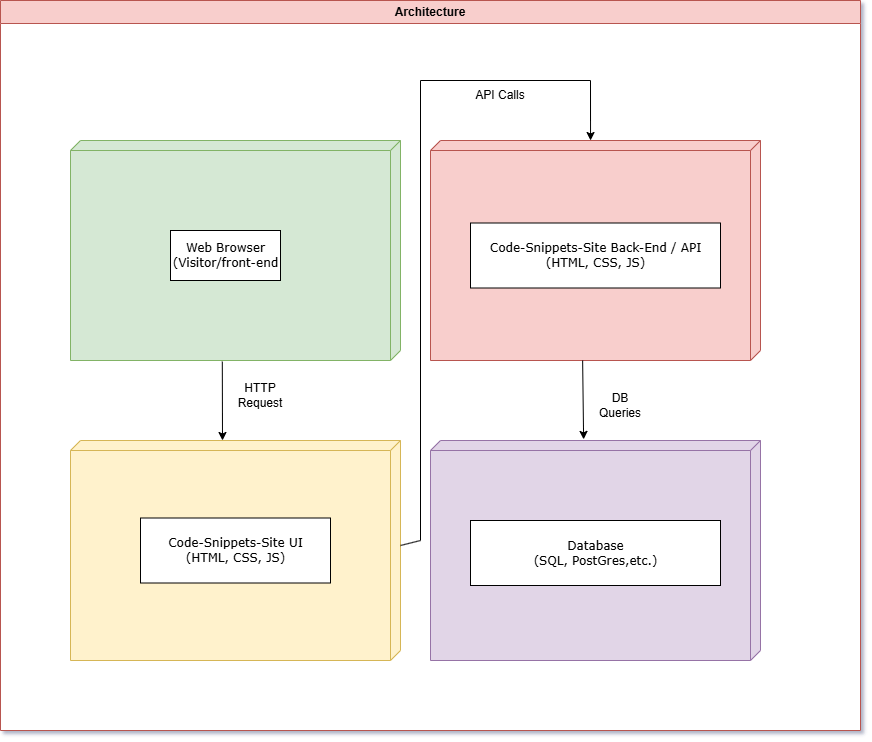
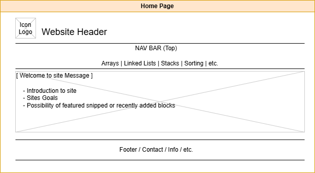
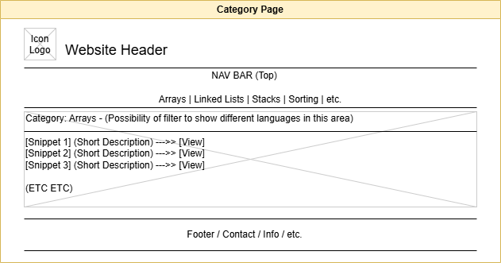
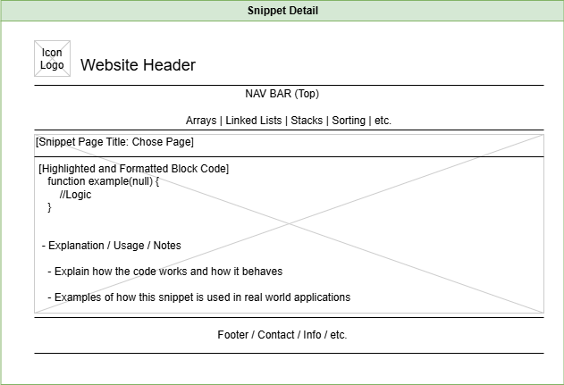
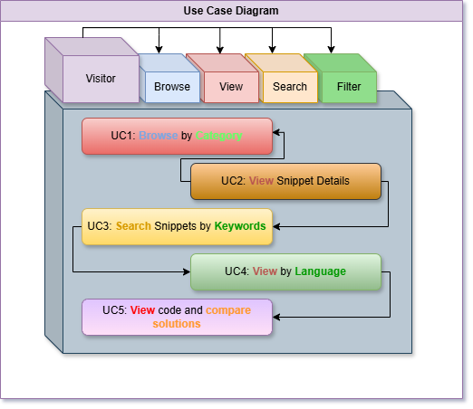

# Code-Snippets-Site 
A user-friendly educations website showcasing **"Code Snippets"** for learning data structures, algorithms, and other software development concepts. Blocks of code contain visual representations of these processes with information on when and how these practices are used.

**Concepts in this preliminary Readme are subject to change over the lifetime of the project cycle to fit evolving needs and implementation of the project scope**

---

## **Table of Contents**  
1. [Overview](#overview)  
2. [Features](#features)  
3. [Solution Architecture Diagram](#solution-architecture-diagram)  
4. [Wireframes](#wireframes)
5. [User Stories](#user-stories)
6. [Use Case Diagram](#use-case-diagram) 

---

## **Overview**  
**Code-Snippets-Redesign** is a site to aide developers explore **data structure concepts** and **programming techniques** that will be aimed towards a more novice developer base for the scope of this project. The platform provides topics like Arrays, Linked Lists, Sorting Algorithms, with more to be implemented with time. Each topic page displays:  
- **Highlighted code snippets** with brief explanations and visual representation of code functions.  
- **Complexity insights** to help understand when the use of these concepts are appropriate.  
- **Basic Overview** attempts to explain concepts in laymens terms to use less technical jargon for a friendlier approach to new developers.  
This repository will contain the **front-end**, **back-end (API)**, and **database schemas** required to make the site function within the scope of the project. Below, you will find **Preliminary design documentation**, **wireframes**, and **targeted use cases**.

---

## **Features**  
- **Structured Navigation**: Quickly jump to categories like **Arrays**, **Sorting Algorithms**, **Trees**, **etc.**. (Will expand with project scope)
- **Code Highlights & Explanations**: Formatted code blocks with accompanied bullet-point summaries and explanations.
- **RESTful API**: Functionality to modify or expand the "Code-Snippet" content via API endpoints on the back end.  
- **Search Functionality (WIP with Future Plans)**: Categories for end-users to choose from for specific concepts that will then offer different implementations to explore. Keyword searches available when there are enough options available for typed search to be necessary.
- **Community Contributions (Future Scope)**: Allow users to add or rate snippets through anonymous or account based means.

---

## **Solution Architecture Diagram**  
**Below is a high-level overview of the system architecture: (WIP:DRAFT SUBJECT TO CHANGE)**
  
Database software may change with time to account for project complexity and need. 

## **Wireframes**
**Wireframe sketches to visualize layout and user flow: (WIP:DRAFT SUBJECT TO CHANGE)**

## **User Stories**  
Below are **five** user stories examples demonstrating how different users could interact with this site:  
- **As a new developer**, **I want** to browse code snippets by category, **so that I can** quickly learn about concepts and how they function.
- **As a visitor**, **I want** to see code snippets with explanations, **so that I can** understand how different concepts work in practice.
- **As a developer**, **I want** to have the ability to search for specific concepts, **so that I can** find specific topics or languages more easily to fit the needs of my project.
- **As a researcher**, **I want** to see the code blocks in other languages to see how implementation and functioning differs between several different programming languages, **so that I can** see examples relating to the programming languages I use and compare it to other languages commonly used.
- **As a self-learner hobbyist**, **I want** to understand certain implementations of code and how they function, **so that I can** compare different solutions to implement features that I desire in my own project while learning more about software developments.

## **Use Case Diagram**

- **UC-01:** Browse Snippets by Category  
**Actor:** Site Visitor  
**Description:** The user clicks a category (e.g., “Arrays, Sortying Algorithms”) to view associated code snippets with what I am interested in finding more information with.  
**Preconditions:** Categories exist in the database (or file structure).  
**Normal Flow:**  
-User selects a concept category from the navigation bar.  
-System queries backend for snippets tagged with the selected category.  
-System displays snippet listings that are called from the databse.  
**Postconditions:** The user can see an overview of snippets wiithing the chosen category.  
**Exceptions:** If no snippets exist or if an error occurs, a “No snippets found” message is displayed with a breif explanation of the error.  

- **UC-02:** View Snippet Detail  
**Actor:** Site Visitor  
**Description:** The user clicks on a specific snippet to see the full code and explanation.  
**Preconditions:** The snippet ID or reference exists.  
**Normal Flow:**  
-User clicks the snippet title or affiliated link.”  
-System retrieves snippet data (title, code, explanation, and animations) from database.  
-System displays the snippet detail page with formatted code, notes, and other related data.  
**Postconditions:** The user can read or copy the snippet code and view the materials related to the concept on the page.  
**Exceptions:** If the snippet ID is invalid or missing, an error or “Snippet not found” page is shown with brief explanation.  

- **UC-03:** Search Snippets  
**Actor:** Site Visitor  
**Description:** The user enters a keyword (e.g., “bubble sort”) into a search bar to find matching snippets through a back-end API call.  
**Preconditions:** The system implements basic keyyword search query functionality (title, tags, or description).  
**Normal Flow:**  
-User types a keyword and submits the search query.  
-System checks the database for matching data sets.  
-System displays a list of relevant snippets and descriptions.  
**Postconditions:** The user sees snippets that match the searched keywords to choose from.  
**Exceptions:** If there are no matches, the system shows a “No results found” message with suggestions on which static categories to click.  

- **UC-04:** Filter Snippets by Language  
**Actor:** Site Visitor  
**Description:** The user applies a language filter (e.g., “JavaScript,” “Python”) to see snippets that have examples within that programming language.  
**Preconditions:** Snippets are tagged or categorized by concept and language in the database.  
**Normal Flow:**  
-User selects a language from a dropdown menu or filter section during their search.  
-System queries the snippet collection for the chosen language(s).  
-The filtered list of snippets is displayed to the user.  
**Postconditions:** The user sees only snippets written in the specified language.  
**Exceptions:** If no snippets exist in that language, show “No snippets found in that language.” then show suggested links.  

- **UC-05:** View Complexity Info  
**Actor:** Site Visitor  
**Description:** The user views the complexity or performance notes for a selected snippet to understand if this is an appropriate solution to fit their needs.  
**Preconditions:** Each snippet includes a property/field for complexity or resource use.  
**Normal Flow:**  
-User opens the snippet detail page.  
-The system displays a short explanation of the snippet’s runtime complexity and any relevant performance considerations.  
-The user reads and gains insight into the snippet’s efficiency to decide if it is appropriate for their use case.  
**Postconditions:** The user understands the snippet’s complexity and potential limitations.  
**Exceptions:** If no time complexity data is provided for a snippet, show a placeholder or “Under Review” text.  